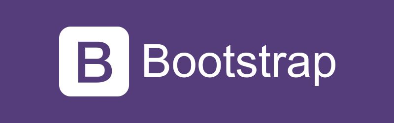

# Framework Bootstrap

_April 2021_

> 🔨 Overview and exemple From Udemy [Bootstrap en partant de Zéro - Enzo Ustariz](https://www.udemy.com/course/bootstrap-en-partant-de-zero).

---

Quickly design and customize responsive mobile-first sites with Bootstrap, the world’s most popular front-end open source toolkit, featuring Sass variables and mixins, responsive grid system, extensive prebuilt components, and powerful JavaScript plugins.

<h1 align="center">
    
</h1>

## Demo on Github pages

## Overview

## Useful links

- [Bootstrap](https://getbootstrap.com/)
- [Ziratsu/Projet1Bulma](https://github.com/Ziratsu/Bac-a-Sable-1)
- [Ziratsu/ProjetBootstrapFormation](https://github.com/Ziratsu/ProjetBootstrapFormation)
